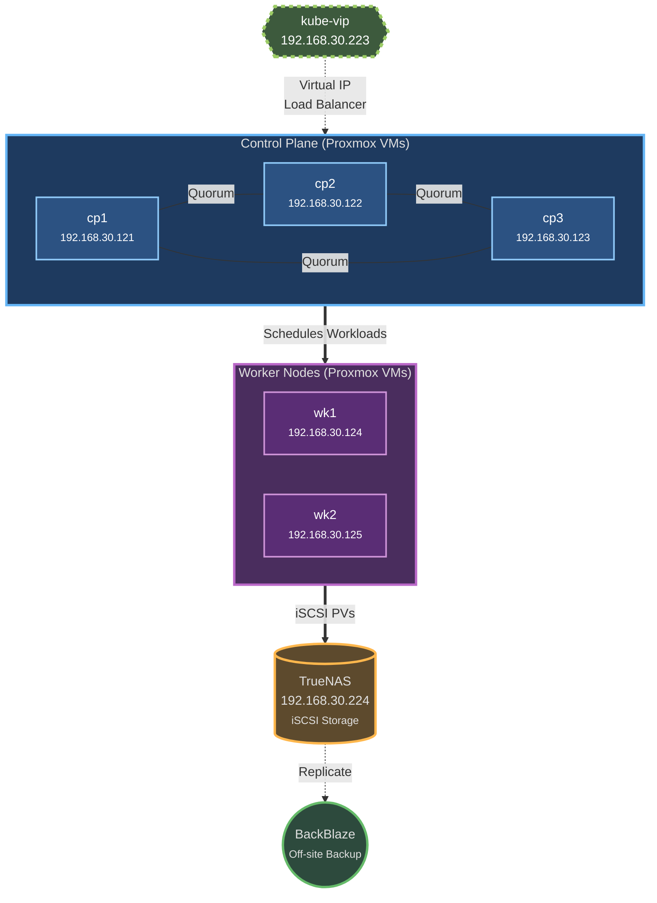

# K3S Setup

## Architecture Overview

- **kube-vip**: Virtual IP (192.168.30.223) load balancer for K8s API across control plane nodes
- **Proxmox Host**: Virtualizes all 5 K3s nodes — 3 control plane + 2 workers (provisioned by OpenTofu)
- **TrueNAS**: Provides persistent storage via iSCSI (Democratic CSI)
- **BackBlaze**: Off-site backup destination for disaster recovery


## Control Plane and Worker VMs (OpenTofu)

VM provisioning is automated — see `terraform/README.md`. In short:

```bash
export PROXMOX_VE_ENDPOINT=https://<proxmox-ip>:8006/
export PROXMOX_VE_API_TOKEN='terraform@pve!provision=<uuid>'
./provision.sh
```

This builds template VM 920 from the Ubuntu 24.04 minimal cloud image and
clones cp1–cp3 (192.168.30.121–123) and wk1–wk2 (192.168.30.124–125).
Cloud-init assigns static IPs and installs qemu-guest-agent, so neither
`static-ip.sh` nor manual post-clone steps are needed for VMs.

## Manual setup - Physical Worker Nodes (optional)

The minimal cluster is all-VM; these steps apply only if you later add a
physical (bare-metal) node. Add its IP to the `[node]` group in
`inventory/minimal-cluster/hosts.ini` — a node not in the inventory will
never join the cluster.

* Use Ubuntu 24.04 server minimal ISO image
* Create a user `ansibleuser`

### Setup Passwordless SSH Auth
```bash
ssh-copy-id ansibleuser@<physical-node-ip>
```

### Root passwordless
```bash
sudo su - root
cd /root
cp -r /home/ansibleuser/.ssh /root
```

### Add user to sudoers
```bash
visudo -f /etc/sudoers.d/ansibleuser

ansibleuser ALL=(ALL) NOPASSWD:ALL
```

### Create local ssh config
```bash
Host <name>
 HostName <physical-node-ip>
 User ansibleuser
```

## K3s deployment

* Open up `https://github.com/scottseotech/k3s-ansible`
* check out minimal-nodes-setup branch

### Static IP and custom MTU (physical nodes only)

* VM static IPs are handled by cloud-init during provisioning — `static-ip.sh` applies only to physical nodes
* cd into k3s-ansible repo
* execute static-ip.sh to set interface name and static ip on physical nodes:
  `./static-ip.sh <current_ip> <new_static_ip>`
* omit the MAC argument unless deliberately pinning to a NIC other than the one
  the node is currently reachable on. The playbook auto-detects the live NIC and
  refuses to write a MAC that is not present on the target, because netplan matches
  by MAC with `dhcp4: false` — a stale MAC leaves the node with no interface at all,
  recoverable only from a physical console. This is what happened to w102 after a
  board swap (2026-08-23)
* if the NIC is not already named eth0, the node must be REBOOTED to finish:
  systemd-networkd cannot rename an interface that is UP, and k3s-node.service
  hardcodes `--flannel-iface=eth0`
* site.yaml playbook configuration expects same interface name for all nodes
* Configure inventory/minimal-cluster/group_vars/all.yml
* run: ./deploy.sh minimal-cluster

* ping 192.168.30.223 verify vip is working
* mv kubeconfig ~/.kube/config
* execute scripts/create-ns.sh
* kubectl apply -f ./todo-secrets.yaml

LincStation N2 Notes:

Installation Issue
`Error can't find partition 2 on mmcblk0`

sed -i s/tries=30/tries=130/ /usr/lib/python3/dist-packages/truenas_installer/install.py